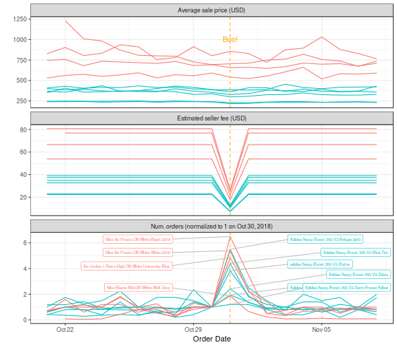
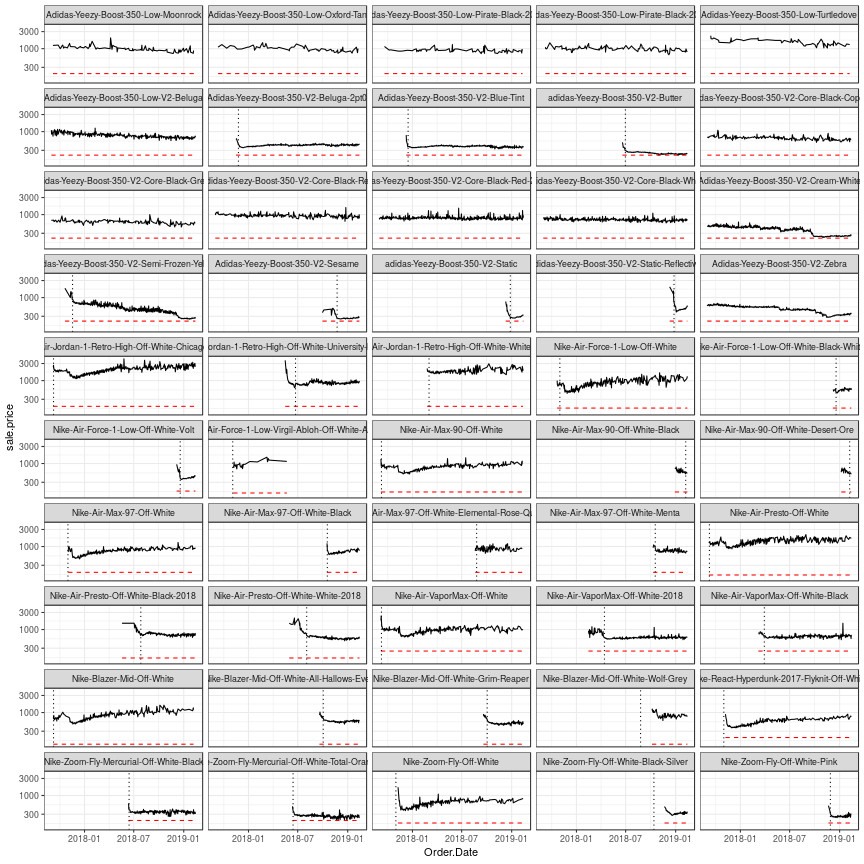

# stockXls

## Halloween fee reductions 
Here is the time series around a Hallowwen discount that reduced the fee from 9% to 3% (approx.). 
There was also a $5 minimum fee, so the percentage reduction actually varied by the price. 
The data this is based on is just trades, but presumably the micro bid/ask data is available. 
I think understanding why there is no detectable chance in price is quite interesting. 

# Time-series of prices (w/ public release dates)
